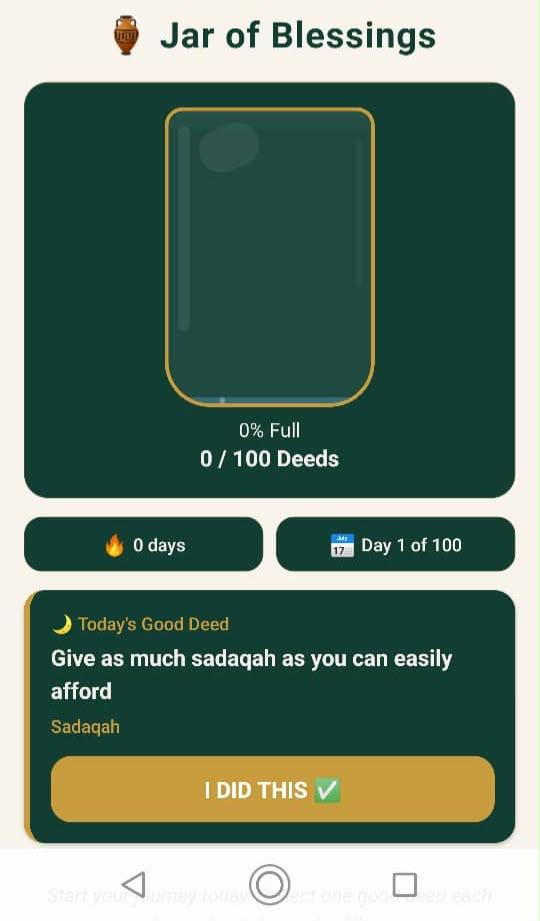
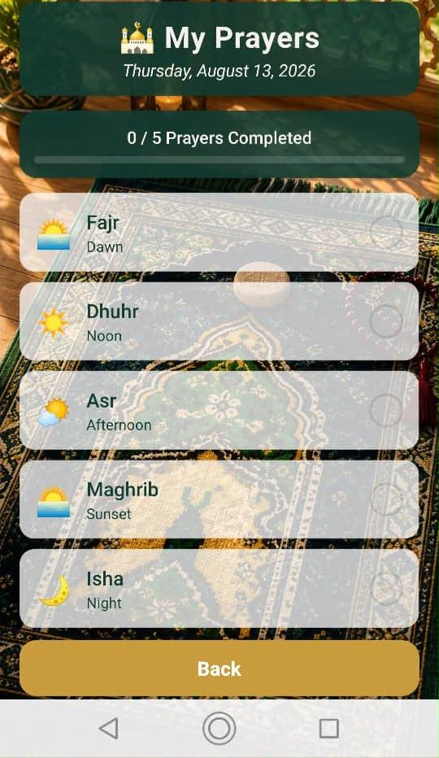
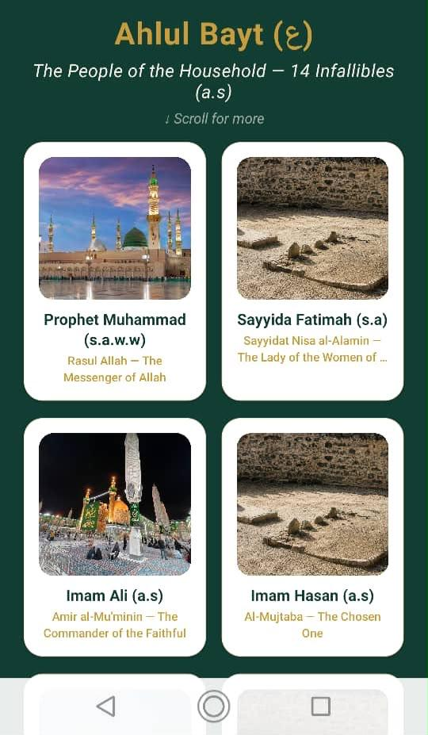
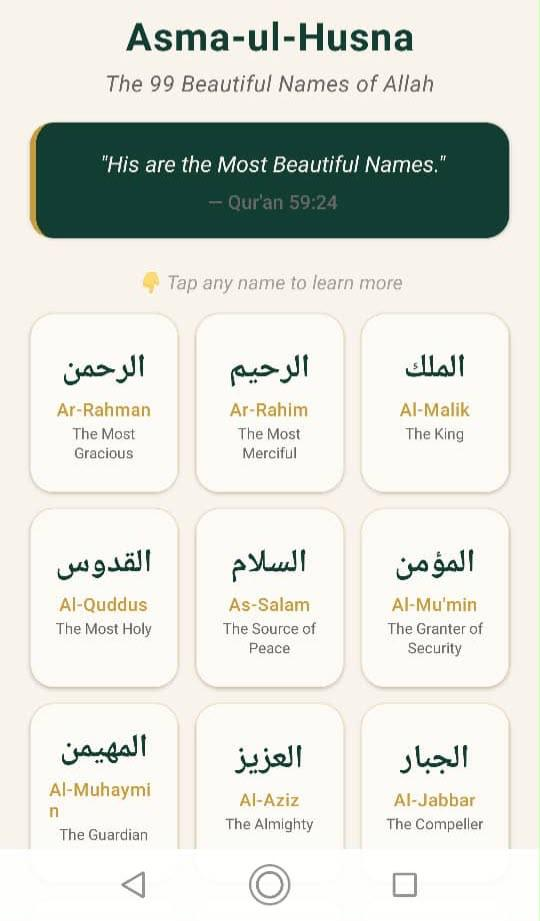

  

<h1 align="center">🌸 NARJIS</h1>

  <strong>Islamic app for daily growth & Quranic guidance.</strong>

---

Narjis helps you find comfort in the Qur'an, connect with the Ahlul Bayt (ع), track your prayers, collect good deeds, and find the right words when you can't speak.

---

## 📱 Screenshots

  
  
  
  
  
  
  
  

---

## ✨ Features

- **Journey System** — Answer 2 questions, receive a personalized verse from the Holy Qur'an
- **Verse of the Day** — Daily spiritual nourishment
- **Asma-ul-Husna** — 99 Beautiful Names of Allah
- **Ahlul Bayt (ع)** — Learn about the 14 Infallibles
- **Good Deed Jar** — Collect 100 deeds, unlock 4 achievement cards (Silver, Gold, Platinum, Diamond)
- **Salat Tracker** — Track 5 daily prayers
- **When Words Fail** — Du'as from Sahifa Sajjadiyya for 10 moods
- **Favorites** — Save verses that touch your heart
- **Achievements** — Unlock cards as you grow
- **Streak Tracking** — Stay consistent with daily engagement

---

## 🛠️ Tech Stack

- **Framework:** Expo (React Native)
- **Language:** TypeScript
- **Storage:** AsyncStorage
- **Navigation:** Expo Router
- **Notifications:** Expo Notifications

---

## 🔒 Privacy

No accounts. No data collection. Everything stays on your device.

[Privacy Policy](https://the-quran-companion.netlify.app/privacy-policy)

---

## 📲 Download

Coming soon to Google Play Store.

---

## 📝 Credits

- Qur'an translations by Mohammed Marmaduke Pickthall
- Du'as from Sahifa Sajjadiyya (Imam Zayn al-Abidin ع)

---

## 🌸 About the Name

**Narjis** — named after Sayyida Narjis (s.a), the mother of Imam al-Mahdi (ع). It means "narcissus flower" — a symbol of beauty, grace, and light.

---

  Made with intention of Sadqa jariya. May Allah accept it. 🤲

